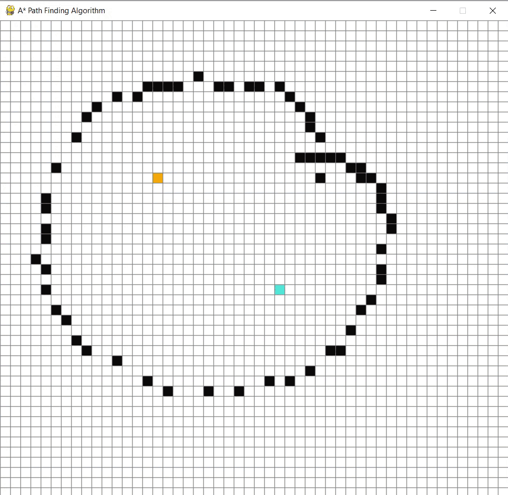
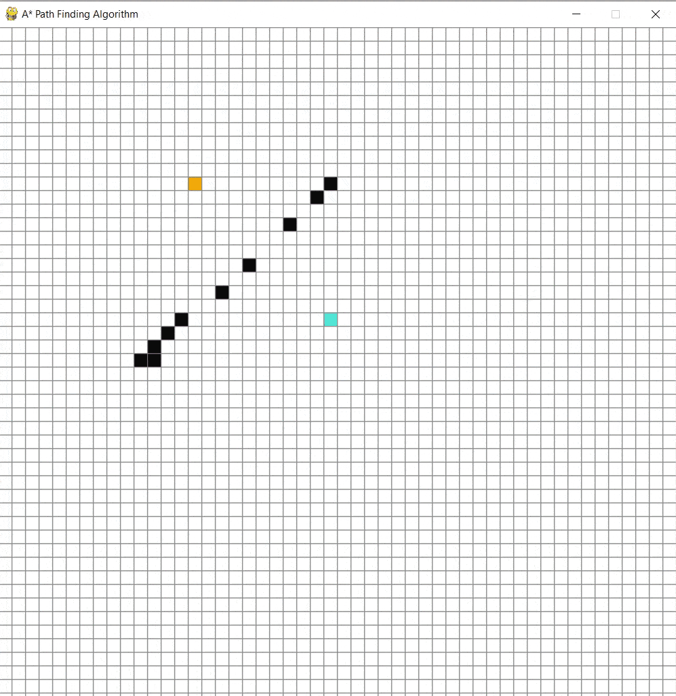
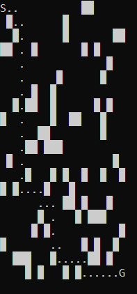

## Path finding Algorithms

### Graph Traversal and Pathfinding Algorithms

Here are the implementation(mostly A*) of the Graph traversal and insights from the chapter 'SOLVING PROBLEMS BY SEARCHING' of the Artificial Intelligence: A Modern Approach [book](https://g.co/kgs/dz86yy2) 
#### Breadth-First Search (BFS)
BFS systematically explores a graph level by level, starting from a chosen node. It explores all neighbor nodes at the present depth before moving on to nodes at the next depth level. BFS is optimal for finding the shortest path in an unweighted graph, ensuring the shortest path is found when traversing the graph level by level.
- It follows FIFO data structure(new which are always deeper go back of the queue)
- Root node is expanded first, then all the successors of the root node are expanded at the given depth.
> BFS is optimal if the path cost is non decreasing function of the depth of the node.
> Space complexity O(bd) where b = branching factor > No of children at each node.

#### Depth-First Search (DFS)
DFS plunges depth-first into a graph, exploring as far as possible along each branch before backtracking. 
It explores as far as possible along each branch before backtracking. 
DFS is commonly used in topological sorting, cycle detection, and solving puzzles with multiple solutions. However, it may not find the shortest path and can get stuck in infinite loops in graphs with cycles.
- DFS will explore the entire left subtree even if the right node is a goal node that's the drawback.
- Due to space complexity it is useful.
  - Graph based search, avoids repeated states and redundant paths.
  - Tree based search, infinite loop can happen.

#### A* Algorithm
A* is an informed search algorithm that finds the least-cost path from a start node to a goal node.
It evaluates nodes by combining the cost to reach the node (known as g-value) and an estimate of the cost to get 
from the node to the goal (known as the heuristic or h-value). A* uses this evaluation function to select the 
most promising nodes to explore next. A* is both complete and optimal under certain conditions, making it widely used 
in pathfinding applications such as route planning in maps and games.
- Minimizing the total estimated solution cost.
- It evaluates nodes by combining the g(n), the total cost to reach the node, and h(n) the cost to 
get from node
> node = g(n) + h(n)
- h(n) is the estimated cost
  - cheapest would be value of g(n) + h(n)
  - h(n) be an admissible heuristic. Never overestimate the cost to reach the goal.
A heuristic h(n) is consistent if, for every node 'n' and every successor n' of n generated by any action a, the estimated cost
of reaching the goal from nis greater than the step cost of getting to n' plus estimated cost of reaching the goal from n'.>
> Compare to above, below you can see how A* is optimal solution whereas BFS and DFS are working too hard to get the destination specially DFS.

#### Maze path finding implementation

The implementation includes:
- Building a maze, add your own sparsit (`maze.py`)
- A* implementation (`generic_search.py`)

To explore the Maze implementation, please check the [`Maze` folder](maze/maze.py) in this repository.

